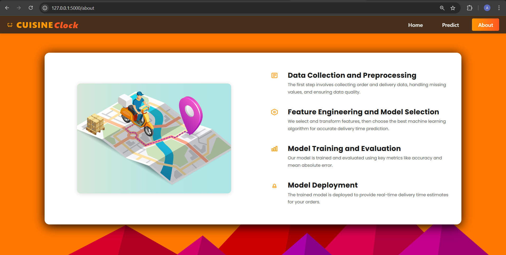

# **CuisineClock: Food Delivery Time Optimizer**

A machine learning-powered web app that predicts food delivery times based on real-world order and delivery details.  
Built with a Flask backend and a modern HTML/CSS/JS UI.

---

## 🏠 App Preview
#### **Home Page**

#### **Prediction Page**

#### **About Page**

#### **Output Page**

---

## 🚀 **Features**

- **Predicts delivery time** for food orders using a trained Random Forest model.
- **Interactive web interface** with easy-to-use form.
- **Flask backend** for fast, real-time predictions.
- **Modern UI** built with HTML and CSS.

---

## 🗂️ **Project File Directory Structure**

Carefully notice the structure of the file directory. The file "rf.pkl", which is the model file, and supposed to be under the folder "models" hasn't been uploaded to github because of it's large size(272 mb). Please follow the instructions given after this section to download the model file from the given link and use it to run the project.

---

## 📦 Getting Started

### 1. Clone the repository

### 2. Download the Pretrained Model

The `rf.pkl` file (Random Forest model) is required for predictions but is too large for GitHub.  
[**Download rf.pkl from Google Drive**](https://drive.google.com/file/d/1KvRlk09-F5--Ppm0xHVppUSsVQ2i317n/view?usp=drive_link)

After downloading, **place `rf.pkl` inside the `model/` directory**.

---

## 📝 How the Model Was Built

- **Data Preparation:** Cleaned and preprocessed real-world food delivery data.
- **Feature Engineering:** Used label encoding for categorical variables, handled missing values, and selected relevant features.
- **Model Selection:** Compared multiple algorithms and chose the best-performing Random Forest model for delivery time prediction.
- **Model Evaluation:** Evaluated using accuracy and mean absolute error.
- **Model Export:** Saved the trained model as `rf.pkl` for deployment.

*See the full workflow in [`python_notebook/modelBuildProcedure.ipynb`](python_notebook/modelBuildProcedure.ipynb).*

---

## 🖥️ Tech Stack

- **Backend:** Python, Flask
- **Frontend:** HTML, CSS, JS
- **ML Libraries:** scikit-learn, pandas, numpy, xgboost

---

## 🛠️ Running the App Locally

1. **Install dependencies:**

2. **Start the Flask server:**

3. **Open your browser and go to:**  
[http://127.0.0.1:5000](http://127.0.0.1:5000)

---

## 🙋‍♂️ Questions?

Open an issue or contact:
- [agnik.patra2023@vitstudent.ac.in]
- [anasmita.2023@vitstudent.ac.in]
- [varsa.k2023@vitstudent.ac.in]
- [uppalapati.asritha2023@vitstudent.ac.in]

